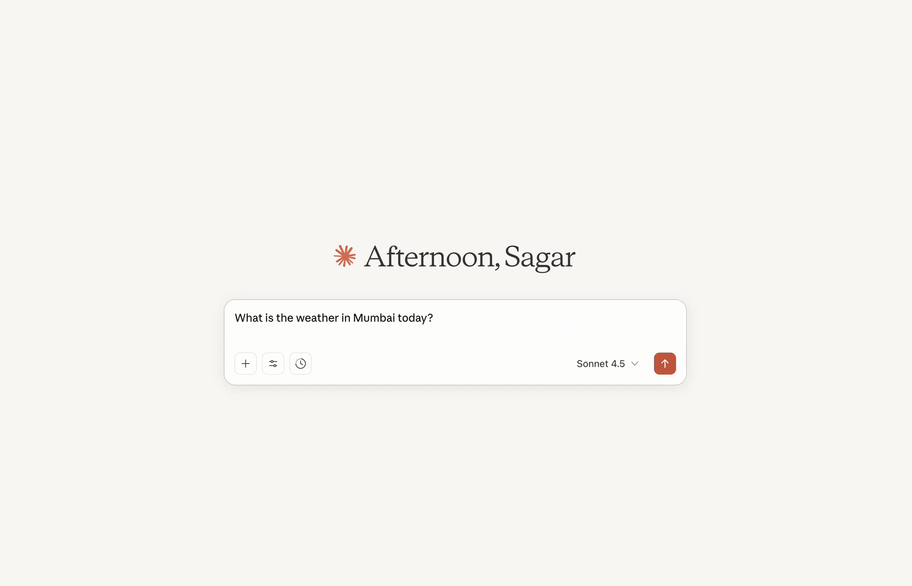

# Exploring MCP (Model Context Protocol)

A learning project for understanding and building MCP servers using Python and FastMCP.

## Demo



## What is MCP?

Model Context Protocol (MCP) is an open standard that enables AI applications to securely connect to external data sources and tools. It provides a unified way for AI models like Claude to interact with various services through a standardized protocol.

## Project Structure

```
exploring-mcp/
├── src/
│   └── 000_dumb_mcp.py    # Simple MCP server example
├── docs/                   # Documentation and guides
├── pyproject.toml          # Project dependencies
└── uv.lock                 # Lock file for reproducible builds
```

## Setup

This project uses [uv](https://github.com/astral-sh/uv) for fast, reliable Python package management.

### Prerequisites

- Python 3.12 or higher
- uv package manager

Install uv:
```bash
curl -LsSf https://astral.sh/uv/install.sh | sh
```

### Installation

1. Clone the repository:
```bash
git clone <your-repo-url>
cd learning-mcp-server
```

2. Sync dependencies:
```bash
uv sync
```

This will create a virtual environment and install all required dependencies.

## Running the Examples

### Simple Weather Server (000_dumb_mcp.py)

A basic MCP server with a weather tool and settings resource.

**Run with STDIO (for Claude Desktop):**
```bash
uv run python src/000_dumb_mcp.py
```

**Run with HTTP transport (for web services):**
Edit `src/000_dumb_mcp.py` and change:
```python
mcp.run(transport="http", host="127.0.0.1", port=8000)
```

## Integrating with Claude Desktop

1. Find your Claude Desktop config file:
   - **macOS**: `~/Library/Application Support/Claude/claude_desktop_config.json`
   - **Windows**: `%APPDATA%\Claude\claude_desktop_config.json`

2. Add the MCP server configuration:
```json
{
  "mcpServers": {
    "weather-server": {
      "command": "/Users/YOUR_USERNAME/.local/bin/uv",
      "args": [
        "run",
        "--with",
        "fastmcp",
        "python",
        "/full/path/to/learning-mcp-server/src/000_dumb_mcp.py"
      ]
    }
  }
}
```

3. Restart Claude Desktop completely

4. Look for the hammer icon (🔨) to confirm MCP tools are loaded

## Development

### Adding New Dependencies

```bash
uv add <package-name>
```

### Removing Dependencies

```bash
uv remove <package-name>
```

### Running Scripts

```bash
uv run python src/your_script.py
```

## Learning Resources

- [Official MCP Documentation](https://modelcontextprotocol.io)
- [FastMCP Documentation](https://gofastmcp.com)
- [MCP Specification](https://modelcontextprotocol.io/specification)

## Project Goals

This project aims to:
1. Understand MCP fundamentals and architecture
2. Learn how to build production-ready MCP servers
3. Explore real-world use cases beyond basic examples
4. Document industry adoption and best practices

## License

MIT
